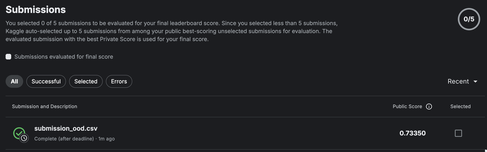

# Midterm Challenge

## Getting Started

```bash
conda create -n dl4ds python=3.10
conda activate dl4ds
python -m pip install -r requirements.txt
```

## Training

```bash
# part 1
python scripts/train.py --base_config_dir ./config --model_config convnet.yml

# part 2
python scripts/train.py --base_config_dir ./config --model_config resnet50.yml

# part 3
python scripts/train.py --base_config_dir ./config --model_config resnext50_32x4d.yml
```

## Evaluation

```bash
# part 1
python scripts/evaluate.py --base_config_dir ./config --model_config convnet.yml

# part 2
python scripts/evaluate.py --base_config_dir ./config --model_config resnet50.yml

# part 3
python scripts/evaluate.py --base_config_dir ./config --model_config resnext50_32x4d.yml
```

# Report

## AI Disclosure Statement

I used Cursor as an auto-completion tool to help me write the code for this assignment. I also used the embedded chat tool in Cursor to help debug errors in the code. I also brainstormed potential ideas in the Claude chat web interface and asked it to help explain concepts about the algorithms I was building (e.g. debugging an issue with linear warmup in the cosine annealing learning rate scheduler). I also used the Claude chat web interface to revise and check the validity of the report as well as improve the clarity of the report. I wrote most of the code with occasional auto-completion from Cursor. The only code that was generated mainly by AI was the `CosineScheduler` class in `src/cv/utils/misc.py`. I organized my codebase in a modular way with yaml file configs to allow for easy experimentation and comparison of different models.

## Model Performance

Best leaderboard performance (#2 in leaderboard with username `lavaman151 (Alex Lavaee)`):



*Part 1: 5 Block ConvNet*

0.57177

*Part 2: ResNet50*

0.66369

*Part 3*:

* ResNext50_32x4d: 0.72488
* ResNet101: 0.72717
* ResNext50_32x4d TTC: 0.73350

## Model Description

Part 1:

I pre-trained a standard convolutional neural network architecture with 5 convolutional blocks. Each block has a double convolutional layer with a batch normalization layer first and then an activation function (LeakyReLU). I chose LeakyReLU because it demonstrates better empirical performance than ReLU and has allows leakage of negative values to the output. The output of the last block is flattened, followed by a fully connected layer with a dropout layer and finally a final fully connected layer for the 100 classes of the CIFAR-100 dataset.

Part 2:

I attempted pre-training the model on the CIFAR-100 dataset, but realized that it was more efficient to use the pre-trained ImageNet weights ResNet50 model. I also tried transfer learning (freezing the backbone and only training the final fully connected layer), but this did not yield good results. I hypothesize this is because the ResNet50 architecture needs to be fine-tuned to better represent features of 32x32 CIFAR-100 images compared to 224x224 ImageNet images.

I then used the pre-trained ImageNet weights and fine-tuned ResNet50 on the 32x32 images of the CIFAR-100 dataset. The output of the last block is flattened, followed by a fully connected layer with a dropout layer and finally a final fully connected layer for the 100 classes of the CIFAR-100 dataset.

Part 3:

Following the same strategy as Part 2, I fine-tuned a ResNext50_32x4d model on the CIFAR-100 dataset. The ResNext50_32x4d (cardinality $C = 32$, $d = 4$, i.e. 32 parallel branches of 4 filters each) model is interesting in that it explores a different type of scaling strategy (i.e. 32x4d instead of 1x1d in the ResNet architecture). Typically, ResNets expand the depth and width of the network, however, ResNext explores a different model scaling strategy, referred to as **cardinality** $C$ which represents the number of parallel branches in the network. I then fine-tuned the model on the CIFAR-100 dataset. The output of the last block is flattened, followed by a fully connected layer with a dropout layer and finally a final fully connected layer for the 100 classes of the CIFAR-100 dataset.

## Hyperparameter Tuning

I played around with many hyperparameters. For brevity, I will only highlight the general hyperparameters and the parameters specific to the ResNext50_32x4d model. The best set of hyperparameters can be found in `config/train.yml` and `config/models/resnext50_32x4d.yml`.

Model Architecture:
* cardinality $C$
* base width $d$
* activation function used in network

Regularization:
* dropout rate
* drop block rate
* label smoothing
* weight decay

Optimizer:
* optimizer (AdamW, SGD, etc.)
* learning rate (min learning rate, max learning rate)
* learning rate warmup epochs
* learning rate warmup start learning rate

Note: I used an optimizer known as ADOPTW which is an extension of AdamW that allows for convergence with any $\beta_2$ parameter. I used $\beta_2 = 0.9999$ for all experiments, but since the characteristics of the optimizer are a bit different than AdamW, I had to adjust the learning rate and schedule to achieve good performance. I also found that in practice, ADOPTW is more sensitive to the learning rate and schedule than AdamW requiring 1/2 or even 1/3 of the learning rate of AdamW to converge.

Training:
* num epochs
* clip gradient value in fp16 training

Data Augmentation:
* hflip probability
* brightness probability
* gaussian noise probability
* jpeg compression probability
* rotation probability
* color jitter probability
* cutmix/mixup

The hyperparameter search process was mainly done by trial and error by adjusting according to the gradient norms and validation loss. Starting hyperparameters were chosen based on previous literature (e.g. ResNet paper).

## Regularization Techniques

I used a combination of regularization techniques to improve the performance of the model.

### Dropout

I used a dropout rate of 0.5 for the ResNext50_32x4d model in the classification head.

### Drop Block

I used a drop block rate of 0.5 for the ResNext50_32x4d model. Drop block is shown to be effective for very deep networks (e.g. ResNet101) and is a type of dropout that randomly drops entire blocks of features in the feature maps of convolutional layers instead of individual features.

### Label Smoothing

I used a label smoothing value of $\epsilon = 0.1$ for the ResNext50_32x4d model. Label smoothing is a regularization technique that helps prevent overfitting by encouraging the model to be less confident in its predictions.

### Weight Decay

I used a weight decay value of 0.02 for the ResNext50_32x4d model. Weight decay is a regularization technique that helps prevent overfitting by penalizing large weights in the model.

## Data Augmentation Strategies

Augmentations techniques can be visualized in the [notebooks/visualize_data.ipynb](./notebooks/visualize_data.ipynb) file.

### Normalization

I used ImageNet normalization for the pre-trained models and also used Contrast-Limited Adaptive Histogram Equalization (CLAHE) for the CIFAR-100 dataset to improve the contrast of the images similar as mentioned in [Hendrycks et al. (2019)](https://arxiv.org/abs/1903.12261).

### Horizontal Flip Probability
Probability of flipping an image horizontally (left to right) during training. This creates mirror images that help models become invariant to horizontal orientation.

### Brightness Probability
Probability of randomly adjusting image brightness during training. Helps models generalize across different lighting conditions.

### Gaussian Noise Probability
Probability of adding random Gaussian noise to an image. Helps models become robust against sensor noise and improves generalization.

### JPEG Compression Probability
Probability of applying JPEG compression artifacts to images. Helps models learn to handle real-world image quality degradation from compression.

### Rotation Probability
Probability of rotating an image by a random angle. Teaches models to recognize objects regardless of their orientation.

### Color Jitter Probability
Probability of randomly modifying color properties (hue, saturation, contrast) of an image. Helps models become invariant to color variations.

### CutMix/MixUp
Techniques that combine multiple training images:
- **MixUp**: Blends two images by taking a weighted average
- **CutMix**: Replaces rectangular regions of one image with patches from another

## Results Analysis

My best model submission was technically the ResNet101 architecture (similar configuration as explained in Part 2), but I chose to use the ResNext50_32x4d model for the final submission because it had a much greater compute to performance ratio and allowed me to explore a different model scaling strategy, test-time augmentations allowing me to get the 0.73350 accuracy score in the public leaderboard.

### Test-Time Augmentations

Inspired by the paper [Docherty et al. (2024)](https://arxiv.org/abs/2410.19836), I implemented test-time augmentations for my best ResNext50_32x4d model. I used image shift operations ("Moore neighborhood" transformations) to generate 16 different augmentations of the test image. I then averaged the probabilities of the 16 augmentations to get a final prediction. This yielded my highest accuracy score in the public leaderboard.

## Experiment Tracking Summary

A WandB report of my experiments and ablation studies can be viewed here: https://api.wandb.ai/links/artificial-intelligence-research/7d1ou70c

## Results Analysis

The model performance in the out-of-distribution dataset was not as good as the in-distribution dataset. There was around a 10% drop in accuracy compared to current state-of-the-art models. This is likely due to the fact that the out-of-distribution dataset is more complex and contains more variations in the images. More powerful pre-trained transformer-based models like V-JEPA and DINOv2 have shown to have very promising results on a wide variety of image understanding tasks. Using these models as a backbone and linear probing or fine-tuning for even better performance on the CIFAR-100 dataset could yield better results. I also did not explore interpolating the 32x32 images to 224x224 images as a way to improve performance on the out-of-distribution dataset. A future approach could interpolate the images to 224x224 images and then use a pre-trained model to extract features which could then be used to train a classifier on the CIFAR-100 dataset. This could make more sense given that most modern backbones are pre-trained on 224x224 or 256x256 images.

## Sources

- He, K., Zhang, X., Ren, S., & Sun, J. (2015). [Deep Residual Learning for Image Recognition](https://arxiv.org/abs/1512.03385). arXiv:1512.03385.

- He, T., Zhang, Z., Zhang, H., Zhang, Z., Xie, J., & Li, M. (2018). [Bag of Tricks for Image Classification with Convolutional Neural Networks](https://arxiv.org/abs/1812.01187). arXiv:1812.01187.

- Hendrycks, D., & Dietterich, T. (2019). [Benchmarking Neural Network Robustness to Common Corruptions and Perturbations](https://arxiv.org/abs/1903.12261). arXiv:1903.12261.

- Xie, S., Girshick, R., Dollár, P., Tu, Z., & He, K. (2017). [Aggregated Residual Transformations for Deep Neural Networks](https://arxiv.org/abs/1611.05431). arXiv:1611.05431.

- Docherty, R., Vamvakeros, A., & Cooper, S. J. (2024). [Upsampling DINOv2 features for unsupervised vision tasks and weakly supervised materials segmentation](https://arxiv.org/abs/2410.19836). arXiv:2410.19836.
